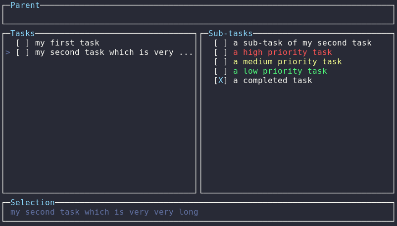

# *yat* -- yet another todo-list
>A simple terminal todo-list manager written in Rust. 

**Table of contents**
1. [Installation](#installation)
2. [Usage](#usage)
3. [Customisation](#customisation)
4. [To Do](#to-do)
5. [License](#license)

**Disclaimer**: this is a work in progress! Version 0.1.0 is available on [crates.io](https://crates.io/crates/yat).

## Installation
Requires an installation of [Rust](https://www.rust-lang.org/tools/install). Recommended build profile is release:
    
    $ curl https://sh.rustup.rs -sSf | sh         # install Rust
    $ git clone https://github.com/drvog/yat-rs   # clone repository
    $ cd yat-rs                                   # change into source directory
    $ cargo run --release                         # compile and run

The latest version can also be installed directly from crates.io:

    $ cargo install yat

By default this downloads and builds the **yat** crate, installing the binary in `$HOME/.cargo/bin/`.

## Usage
Can be run with cargo from the root of the directory. The terminal user interface (TUI) is built around the excellent [termion](https://crates.io/crates/termion) crate. Logging is provided by the nifty [fern](https://crates.io/crates/fern) and [log](https://crates.io/crates/log) crates; this will print to stderr, but these will be missed behind the TUI, so it might be useful to redirect them to a file:

    $ cargo run --release 2>err.log

Once running, **yat** uses the following default key bindings:

|Key      | Command                     |
|---------|-----------------------------|
|a        | add new task                |
|e        | edit selected task          |
|d        | delete selected task        |
|u        | move selected task up       |
|n        | move selected task down     |
|w        | save todo list to file      |
|q        | quit                        |
|Up       | move selection up           |
|Down     | move selection down         |
|Enter    | focus on selected sub-task  |
|b        | return focus to parent task |
|Space    | mark task as complete       |
|>        | increase task priority      |
|<        | decrease task priority      |

The user interface shows 4 panels: parent task, tasks, sub-tasks and selection. The tasks panel is the main panel, which allows you to navigate between tasks.

The layout of the task on the panel is as follows:

    > [ ] todo
    │  │   │         
    │  │   └─ this is the content of the task (colour indicates priority).
    │  │
    │  └─ this shows task completion: [X] = completed, [ ] = not completed.
    │
    └─ this indicates that this task is currently selected.

Usually **yat** will save to $HOME/.todo/save.txt, which will be created the first time it runs. You can specify a custom file to load (or create) by passing it as a first argument on the command line. The formatting of the save file is as follows:

    [ ] ( ) todo
     │   │   │         
     │   │   └─ this is the content of the task.
     │   │
     │   └─ this shows task priority: ( ) = no priority, (C) = low priority,
     │      (B) = medium priority, (A) = high priority.
     │
     └─ this shows task completion: [X] = completed, [ ] = not completed. 

## Customisation
It is possible to tweak the appearance and keybindings of **yat** at runtime using a configuration file, as by default it only uses the basic ANSI colours of your terminal [emulator]. **yat** will look for configuration at `~/.todo/config.toml`, which allows you to change the panel borders and the colour-scheme. The format for `config.toml` is:

    # ~/.todo/config.toml
    [borders]                   # Panel customisation
    hline = "─"                 # horizontal line
    vline = "│"                 # vertical line
    ulcorner = "┌"              # upper left corner
    urcorner = "┐"              # upper right corner
    llcorner = "└"              # lower left corner
    lrcorner = "┘"              # lower right corner

    [colours]                   # Colourscheme customisation
    colour0 = [88, 110, 117]    # black
    colour1 = [220, 50, 47]     # red
    colour2 = [133, 153, 0]     # green 
    colour3 = [181, 137, 0]     # yellow
    colour4 = [38, 139, 210]    # blue
    colour5 = [211, 54, 130]    # magenta
    colour6 = [42, 161, 152]    # cyan
    colour7 = [7, 54, 66]       # white
    colourfg = [131, 148, 150]  # foreground
    colourbg = [0, 43, 54]      # background

    [keys]                      # Keybinding customisation 
    quit = 'q'                  # quit
    back = 'h'                  # return focus to parent
    save = 'w'                  # write list to save file
    add = 'a'                   # add new task
    edit = 'e'                  # edit selected task
    delete = 'd'                # delete selected task
    task_up = 'u'               # move selected task up
    task_down = 'n'             # move selected task down
    up = 'k'                    # move selection up
    down = 'j'                  # move selection down
    focus = 'l'                 # focus on selected sub-task
    complete = ' '              # mark task completed
    increase = '>'              # increase task priority
    decrease = '<'              # decrease task priority

You can specify as many or as few of these as you'd like (with the appropriate toml headers), and **yat** will use default configuration for the rest. The `borders` must be valid unicode, and the `colours` are specified as (r, g, b) where r/g/b are u8 integers, i.e. values in the interval `[0, 256)`. Note importantly this will only work if your terminal supports 24-bit colours ("True Color", see [here](https://gist.github.com/XVilka/8346728)), and is untested on incompatible terminal emulators&dagger;. Keybindings can be changed to other characters (note: use `'\n'` for Return). Some examples are provided in the [configs](configs) directory.

&dagger;It's possible that using `r, g, b < 6` could work, but again, this is untested.

## To Do
1. Loading: although loading from a save file is implemented, the parsing functionality should be made more robust.
2. Clean-up: general code clean-up and refactoring, including more extensive commenting.
3. Windows: currently **yat** is built on top of termion, which works on UNIX-like terminals, and therefore lacks Windows CMD support.

Contributions welcome! Please submit an issue or pull request.

## License

[MIT License](LICENSE)
